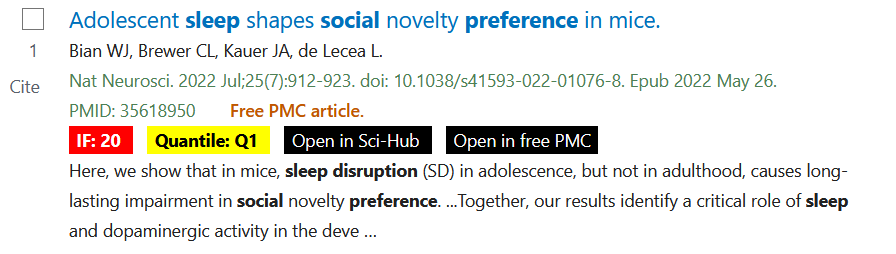
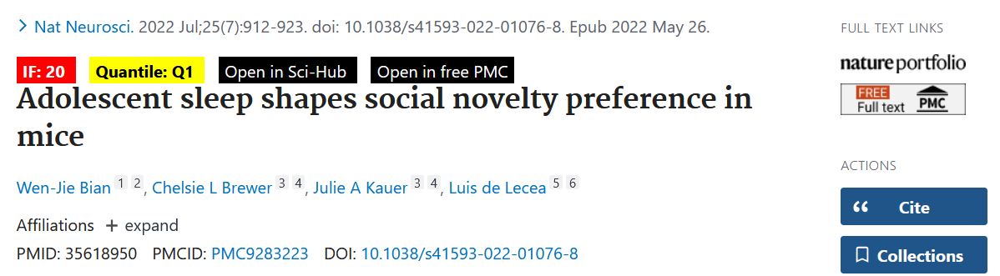

# pubmed_addon
Pubmed addon to display impact factor, quantile, and scihub link

For **Edge Browser**, you can download the [pubmed_addon.zip](https://github.com/BryanWang0702/pubmed_addon/tree/master/pubmed_addon.zip) file, and unpack it on your computer. Then go to [edge://extensions/](edge://extensions/) --> My Extension (Check Developer mode) --> Load unpacked --> Select the unpacked folder which contains the `manifest.json` file.

For **Firefox Browser**, download the [pubmed_addon.xpi](https://github.com/BryanWang0702/pubmed_addon/tree/master/pubmed_addon.xpi) file (do not unpack), go to [about:addons](about:addons) firefox addon management, select `install addon from file`, and select the xpi file.

The impact factor, JCR quantile, scihub link, and PMC free link will display like this:
Search Page:

Article Page

